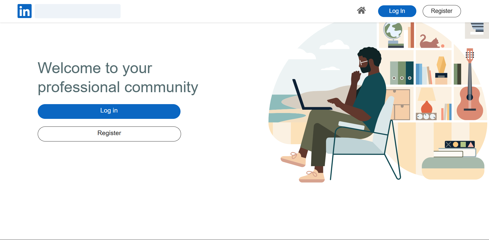
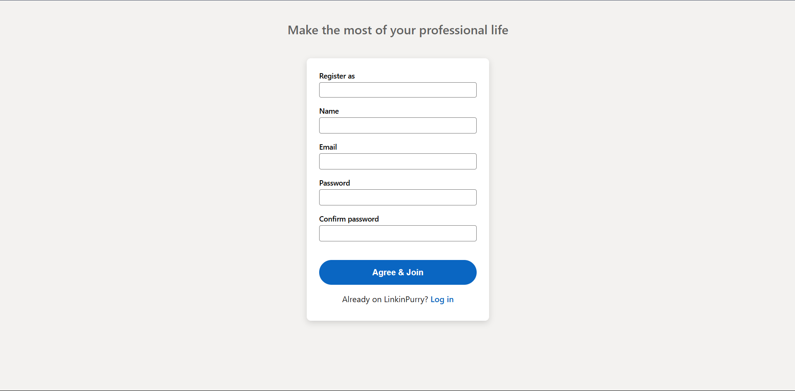
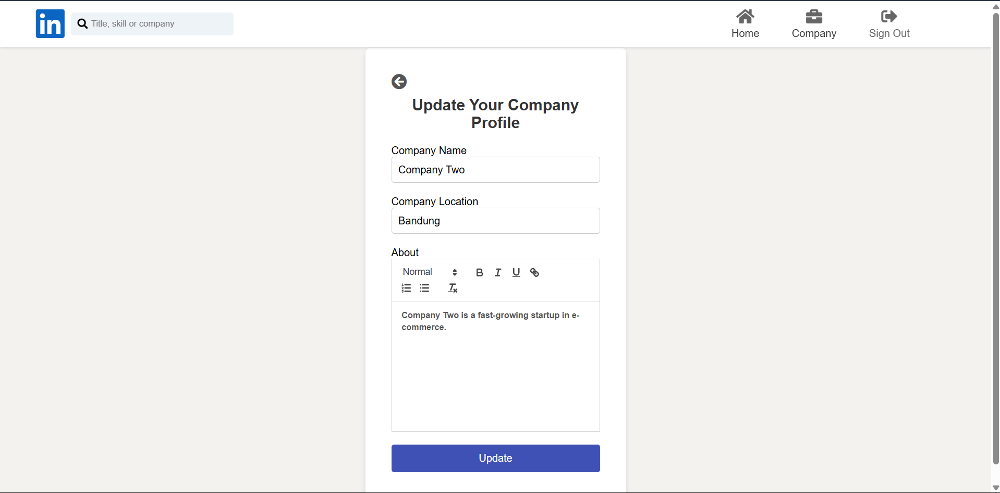

# Tugas Besar IF3110 2024/2025
Tugas Besar Milestone 1 IF3110 Web Based Development: LinkInPurry

> ## **Table of Contents**

- [General Information](#general-information)
- [Requirements](#requirements)
- [How to Run and Compile (Windows)](#how-to-run-and-compile-windows)
- [Screenshot](#screenshot)
- [Author](#author)

## **General Information**
LinkInPurry is a web-based platform that connects Job Seekers with Companies. Job seekers can browse and apply for jobs, while companies can post job openings and manage applicants. Key features include:

- User registration and login for both job seekers and companies.
- Companies can add, edit, and delete job postings.
- Job seekers can apply for jobs by uploading their CV and introductory video.
- Companies can review and manage job applications.
- Data export feature for downloading applicant data in CSV or Excel format for internal use or reporting.

## **Requirements**

To use this program, you will need to install **Docker** on the device you are using.

## **How to Run and Compile (Windows)**

### **Setup**

1. Clone repository

```sh
$ git clone https://github.com/Labpro-21/if3110-tubes-2024-k03-06.git
$ cd if3110-tubes-2024-k03-06
```

### **Compile**

1. Build

```sh
$ docker compose up --build
```
2. Open the application in your browser at http://localhost:8080.

## **Screenshot**
Welcome Page


Register Page


Login Page


Home Jobseeker Page


Home Company Page


Profile Company Page


Edit Profle Company Page


Add Job Page


Update Lowongan Page


Detail Lamaran Page


Detail Lowongan Company Page


Detail Lowongan Jobseeker Page


Detail Halaman Lamaran Page


Detail Halaman Riwayat Page


## Author

| **NIM**  |         **Name**          | **Class** | **Server Side**  | **Client Side** | 
| :------: | :-----------------------: | :-------: | :--------------: | :-------------: | 
| 13522128 | Mohammad Andhika Fadillah |    K03    | Riwayat,ShowProfile | AddLow, UpdateLow, Riwayat, ShowProfile, UpdateProfile, HomeComp, HomeJs |
| 13522142 |   Farhan Raditya Aji    |    K03    | AddLow, UpdateLow, DetailLowComp, DetailLowJs, DetailLamaranComp, HalamanLamaranJs  | DetailLowComp, DetailLowJs, DetailLamaranComp, HalamanLamaranJs |
| 13522160 |   Rayhan Ridhar Rahman    |    K03    | Login, Register, UpdateProfile, HomeComp, HomeJs | Login, Register |

nb: <br>
Js = JobSeeker <br>
Comp = Company <br>
Low = Lowongan
